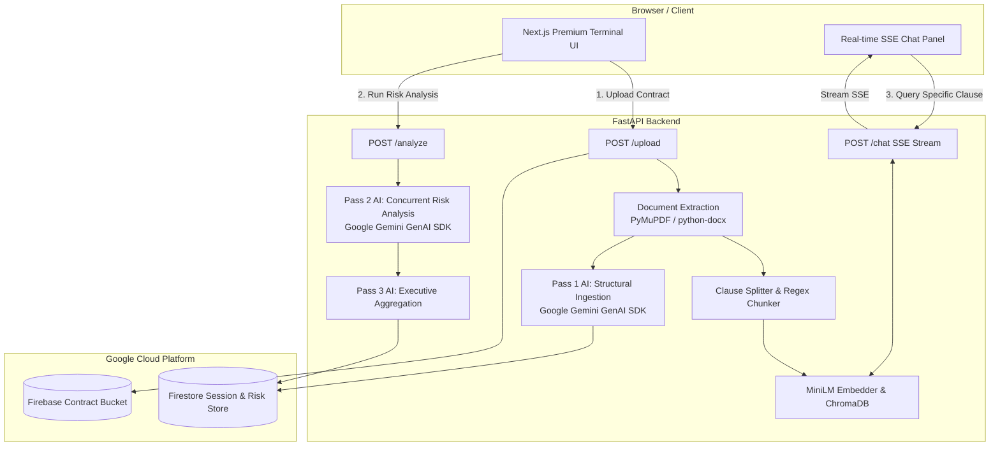

# ⚖️ LexGuard — Enterprise AI Contract Intelligence

<div align="center">
  <p><strong>Demystifying legal agreements through multi-pass AI analysis, vector-grounded RAG, and executive-grade precision UX.</strong></p>
  <p>
    
    
    
    
    
    
    
  </p>
</div>

---

## 📖 Overview

People and businesses sign contracts every day without fully understanding the underlying liabilities. Legal language is deliberately nuanced, lengthy, and opaque. **LexGuard** transforms dense contracts (PDFs & DOCX) into transparent, risk-assessed executive summaries in seconds.

Built with a high-performance **FastAPI** backend, a state-of-the-art **Google Gemini GenAI SDK** pipeline, local **ChromaDB** vector embedding for real-time RAG chat, and a premium **Next.js** frontend inspired by institutional financial terminals, LexGuard empowers signees to negotiate with absolute confidence.

---

## ✨ Core Features

### 🔍 1. Multi-Pass Contract Deconstruction
- **Structural Ingestion:** Directly parses complex PDF and DOCX files using robust text extraction algorithms (`PyMuPDF` / `python-docx`).
- **Pass 1 — Structural Extraction:** Deconstructs contracts into distinct legal clauses, identifying document types, governing laws, and calculating initial **suspicion scores** (0.0 to 10.0) using structured Pydantic schema outputs.

### 🛡️ 2. Deep Risk Taxonomy & Plain English Translation
- **Pass 2 — Granular Risk Analysis:** Concurrently evaluates flagged clauses across standard legal categories (IP transfer, non-compete, indemnification, termination, arbitration).
- **Plain English Breakdown:** Translates legalese into 2-3 sentence non-lawyer summaries.
- **Direct Consequences:** Generates hard-hitting `"If you sign this..."` consequence statements.
- **Verbatim Red Flags:** Extracts precise 3-5 word high-risk phrases directly from the document text.
- **Actionable Negotiation Tips:** Recommends concrete carve-outs, time limits, and scope restrictions for counter-proposals.

### 🤖 3. Grounded RAG Chat Assistant
- **Local Embedding:** Automatically chunks contract text and generates dense semantic vector embeddings via `sentence-transformers/all-MiniLM-L6-v2`.
- **ChromaDB Vector Store:** Houses document embeddings locally for sub-millisecond retrieval.
- **SSE Real-Time Streaming:** Streams answers in real-time through Server-Sent Events (SSE), strictly grounded in document context with verbatim clause citations (e.g., `[Clause: Governing Law]`).

### 🏛️ 4. Enterprise Persistence & Cloud Infrastructure
- **Google Cloud Firestore:** Seamlessly persists session states, parsed contract structures, risk report snapshots, and chat history.
- **Firebase Cloud Storage:** Safely archives uploaded contract artifacts for secure retrieval and auditability.

### 🎨 5. Precision Terminal UX
- **Bloomberg / Surgeon Table Aesthetic:** Information-dense, high-contrast typography and layout with zero fluff.
- **Curated Severity Dashboard:** Instantly highlights **Critical**, **High**, **Medium**, and **Low** risks with custom color-coded badges and filtering.
- **Cinematic Micro-Animations:** Smooth layout transitions powered by **GSAP** and subtle interactive **Three.js WebGL** background canvases.

---

## 🏗️ System Architecture



---

## 🚀 Quickstart & Installation

### 📋 Prerequisites
- **Python 3.11+**
- **Node.js 20+** & **npm**
- **Google Gemini API Key** (`GEMINI_API_KEY`)
- **Google Cloud / Firebase Project** (Firestore & Firebase Storage enabled)

---

### ⚙️ 1. Backend Setup

```bash
# Navigate to the backend directory
cd backend

# Create and activate a Python virtual environment
python3 -m venv .venv
source .venv/bin/activate

# Install dependencies
pip install -r requirements.txt
```

#### Environment Variables (`backend/.env`)
Create a `.env` file in the `backend/` directory:

```env
# Mode configuration
# DEMO_MODE=true bypasses live Gemini/Firebase calls for instant offline testing
DEMO_MODE=false

# Gemini AI Credentials
GEMINI_API_KEY=your_actual_gemini_api_key_here

# Firebase / GCP Project Configuration
GOOGLE_CLOUD_PROJECT=your-gcp-project-id
FIREBASE_STORAGE_BUCKET=your-project.appspot.com

# Optional: Path to Firebase service account JSON key (for local development)
GOOGLE_APPLICATION_CREDENTIALS=/path/to/serviceAccountKey.json
```

#### Run the Backend Server
```bash
uvicorn main:app --reload --port 8000
```
The FastAPI documentation will be instantly accessible at [http://localhost:8000/docs](http://localhost:8000/docs).

---

### 💻 2. Frontend Setup

```bash
# Navigate to the frontend directory
cd frontend

# Install Node dependencies
npm install
```

#### Environment Variables (`frontend/.env.local`)
Create a `.env.local` file in the `frontend/` directory:

```env
NEXT_PUBLIC_API_URL=http://localhost:8000
```

#### Run the Frontend Development Server
```bash
npm run dev
```
Open [http://localhost:3000](http://localhost:3000) in your browser to experience LexGuard.

---

## 📡 Key API Endpoints

| Method | Endpoint | Description |
| :--- | :--- | :--- |
| `GET` | `/health` | API health check and version status. |
| `POST` | `/upload` | Ingests PDF/DOCX contract, runs Pass 1 structural extraction, indexes into ChromaDB, and returns clauses. |
| `POST` | `/analyze` | Executes Pass 2 concurrent risk analysis and Pass 3 overall contract executive aggregation. |
| `POST` | `/chat` | SSE streaming endpoint for real-time document-grounded RAG query and response. |
| `GET` | `/report/{session_id}`| Retrieves complete persisted contract analysis session and risk report from Firestore. |
| `GET` | `/chat/{session_id}/history` | Retrieves historical chat messages for a specific contract session. |

---

## 🧪 Demo / Sandbox Mode

For testing or development without consuming Gemini API tokens or requiring Firebase setup, LexGuard includes a robust **Demo Mode**.

In `backend/.env`:
```env
DEMO_MODE=true
```
When enabled, LexGuard bypasses external network requests and instantly serves highly realistic, pre-computed contract intelligence data models for seamless UI and workflow evaluation.

---

## 🛡️ Security & Privacy Notice

LexGuard is designed with enterprise security in mind:
- **Ephemeral Processing:** In-memory vector embedding ensures that chunked data resides locally inside ChromaDB.
- **Strict Pydantic Enforcement:** All LLM outputs are rigorously validated against strict Pydantic schemas, eliminating prompt injection anomalies and malformed responses.
- **No Model Training:** Contracts processed through the Gemini API under standard enterprise terms are not used to train underlying foundation models.

---

<div align="center">
  <p>⚖️ <strong>LexGuard</strong> — Empowering clarity in every agreement.</p>
</div>
